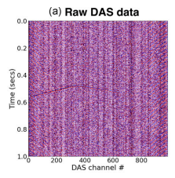
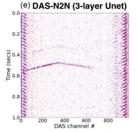
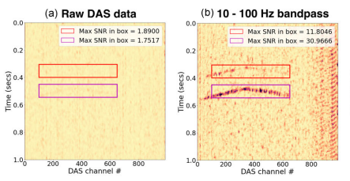
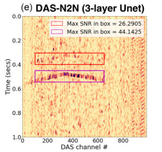

# Сервис для очистки данных DAS

## Магомедов Магомед

# Постановка задачи

Распределенный акустический мониторинг(DAS \- distributed acoustic sensing), активно развивающаяся технология, которая превращает оптоволоконный кабель в массив датчиков, улавливающих механические колебания, например землетрясения, проезд автомобиля, или даже шаги человека. Для лучшего обнаружения сигналов используются методы машинного и глубинного обучения, показывающие state-of-the-art шумоподавление в этой области. Однако не существует высоконагруженных сервисов, предназначенных для обработки данных DAS, для этого и разрабатывается данный проект.

## Формат входных и выходных данных




Рис. 1\. Пример очистки данных

На входе подается матрица n\_channels x n\_samples,  
где n\_channels \- число датчиков, n\_samples \- число измерений.   
Также необходимо дополнительно передать модели на вход частоту дискретизации \- fs \- обычно в Гц, стандартом является 1000 Гц.

На выходе получается матрица точно такого же размера с очищенными данными. 

## 

## Метрики


Рис. 2\. Пример подсчета метрик. a) Сырые данные. b) Полосовой фильтр 10-100 Гц   
e) DAS-N2N \- нейросетевой подход 

SNR \- signal to noise ratio в bbox вокруг сигнала землетрясения. Достаточно получить метрики больше чем при использовании обычных bandpass фильтров. Например, в исследовании ([https://doi.org/10.1093/gji/ggad460](https://doi.org/10.1093/gji/ggad460))  получены такие соотношения(см. Картинки a, b, e, правый верхний угол)  
Также можно использовать signal preservation score \- корреляция Пирсона между сырыми и очищенными данными в окне событий. Значение близкое к 1 значит, что мы не теряем сигнал.

## Валидация и тест

Отложенные val и test выборки, не используем в рамках одного сплита данные из одной и той же записи. Фиксируем split в файле.

## Датасеты

Данные из эксперимента MiDAS (см. [https://g-a51e00.a1bfb5.bd7c.data.globus.org/DAS-Month-02.2023/Academia\_Sinica-MiDAS/README.pdf](https://g-a51e00.a1bfb5.bd7c.data.globus.org/DAS-Month-02.2023/Academia_Sinica-MiDAS/README.pdf)). Содержат записи DAS.

Находятся в репозитории [globus.org](http://globus.org), в публичной коллекции pubDAS. Имеются директории Events и Continuous. 

Объем в сумме \~ 190 Гб. Формат данных \- mseed, каждый канал представлен отдельным файлом. В канале 60 \* 60 \* 60 \* 1000 \+ 1 семплов, что соответствует одному часу записи с частотой 1000 Гц. В записи 125 каналов, это значит, что оптоволокно поделено на 125 виртуальных датчиков. В директории Events 162 записи. В директории Continuous 24\.

В первой находятся 162 папки соответствующие записям землетрясений, включая некоторое время до и после (точное время землетрясений указано в файле earthquake.txt в корневой директории эксперимента). Во второй 24 часа непрерывных данных за 14 февраля(в этот день произошло крупное землетрясение в Румынии).

Из проблем \- объём одной записи \- 1.37 Гб. Это требует обработки по частям, их обычно называют патчами.

Ссылка на расположение в репозитории: https://app.globus.org/file-manager?origin\_id=706e304c-5def-11ec-9b5c-f9dfb1abb183\&origin\_path=%2FDAS-Month-02.2023%2FAcademia\_Sinica-MiDAS%2F.

# Моделирование

## Бейзлайн

Простейшее решение \- bandpass фильтр на 10-100Hz, он уже даёт значительный прирост SNR(видно на картинках выше). Он подавляет частоты не входящие в указанные рамки.

## Основная модель

Обучать будем jDAS ([https://ieeexplore.ieee.org/document/9655039](https://ieeexplore.ieee.org/document/9655039))   

Рис. 3\. Архитектура jDAS модели

Модель обучается маскированным channel modelling. То есть, берём, например, 11 соседних каналов(датчиков), 1 из них случайным образом зануляем, и, так как каналы находятся рядом, мы по соседним каналам пытаемся восстановить его структуру. Идея здесь в том, что модель не будет восстанавливать шум, так как у неё не будет информации чтобы это сделать, а сигнал восстановить сможет. 

# Внедрение

В первую очередь результатом проекта является сервис, также модель можно организовать как пакет, чтобы использовать внутри него. Сервис из себя представляет веб\-сервис с классической архитектурой, позволяет загружать DAS-данные, обрабатывать их разными методами и скачивать их уже очищенные от шума, возможно, с помощью API яндекс диска или напрямую.

# Быстрый старт

```bash
# 1. Клонировать репозиторий
git clone ... && cd jDAS

# 2. Запустить mlflow
mlflow server --host 0.0.0.0 --port 5000

# 3. Тестовое обучение
python -m jdas.train_hydra --config-name test-train

# 4. Веб сервис для очистки
python -m jdas serve
```

# Продвинутое использование 
```
# Заполнить .env файл
# Откройте .env и добавьте YANDEX_DISK_TOKEN

# Настроить DVC
make dvc-setup
# Выберите Яндекс.Диск или локальное хранилище

# Запустить сервер
python -m jdas serve
# Откройте http://localhost:8000

# Обучить модель (опционально)
python -m jdas.train_hydra --config-name
```
# Clean DAS data service

## Magomed Magomedov

Problem Statement  
Distributed acoustic sensing(DAS), is an emerging technology. DAS turns fibre-optic cables into seismic arrays for vibration measurements, e.g. earthquakes, car motion, or even people movement. For best signal detection are used machine and deep learning approaches that exhibit state-of-the-art noise-reduction in this domain. However, there are no high-load services for DAS data processing, for which we develop this project.

Input and Output Data Format

  

Fig. 1\. Example of data cleaning

Input:  matrix n\_channels x n\_samples,  
Where n\_channels \- number of channels, n\_samples \- number of samples.   
Also the model waits for sample frequency as input \- fs \- usually in Hz, standard is 1000 Hz.

Output: matrix with shape as input that contains cleaned data

Metrics  


Fig. 2\. Metrics evaluation example. a) Raw data. b) Bandpass 10-100Hz   
e) DAS-N2N \- deep learning approach 

SNR \- signal to noise ratio in a bounded box around earthquake signal. It’s enough to get metrics more than bandpass filter. For example, in research ([https://doi.org/10.1093/gji/ggad460](https://doi.org/10.1093/gji/ggad460))  gotten these ratios(Fig. 2,  a, b, e, right upper angle)  
Also we can use signal preservation score \- Pearson correlation between raw and clean data in an event window. A value close to 1 means that we don’t lose signal.

Validation  
Hold val and test samples set. Do not use in one split data from one record. Write split in file.

Data  
Data from MiDAS experiment (See [https://g-a51e00.a1bfb5.bd7c.data.globus.org/DAS-Month-02.2023/Academia\_Sinica-MiDAS/README.pdf](https://g-a51e00.a1bfb5.bd7c.data.globus.org/DAS-Month-02.2023/Academia_Sinica-MiDAS/README.pdf)). Contains DAS data.

They are located at [globus.org](http://globus.org), in the public collection pubDAS. There are Events и Continuous directories. 

Summary volume  \~ 190 Gb. Data format \- mseed, each channel in a separate file. In channel 60 \* 60 \* 60 \* 1000 \+ 1 samples, that corresponds to an hour of recording with frequency equals to 1000 Hz. In record there are 125 channels that means fibre divided into 125 virtual sensors. In the Events directory there are 162 records for each earthquake in earthquakes.txt(in experiment root directory). In the continuous directory there are 24 records for 14 February(When was the big Romanian earthquake).

Problems: 1 record volume is 1.37 Gb. It’s needed for processing by parts that are usually called patches.

Link to data repository: https://app.globus.org/file-manager?origin\_id=706e304c-5def-11ec-9b5c-f9dfb1abb183\&origin\_path=%2FDAS-Month-02.2023%2FAcademia\_Sinica-MiDAS%2F.

Modeling

Baseline  
Easiest solution \- 10-100 Hz bandpass filter has significant SNR-improvement(See Fig.2 b). It suppresses frequencies that are not in range.

Main model  
We will train jDAS ([https://ieeexplore.ieee.org/document/9655039](https://ieeexplore.ieee.org/document/9655039))   

Fig. 3\. jDAS model architecture

Model usually trained by masked channel modelling. I.e. we will take, for example, 11 neighbour channels(sensors), 1 channel randomly is setted to zero and because channels are near we try to reconstruct it. The main idea is that the model will not reconstruct noise, because there is no information about this(because noise is incoherent by definition) but coherent signals may be reconstructed.

Deployment  
First of all, the project result is service and within that we can establish the model as a package for use in it. Service is a web-service with classic architecture that allows users to upload DAS data, process it with different methods and download the noise-clean results, perhaps using yandex disk API or directly from itself.


